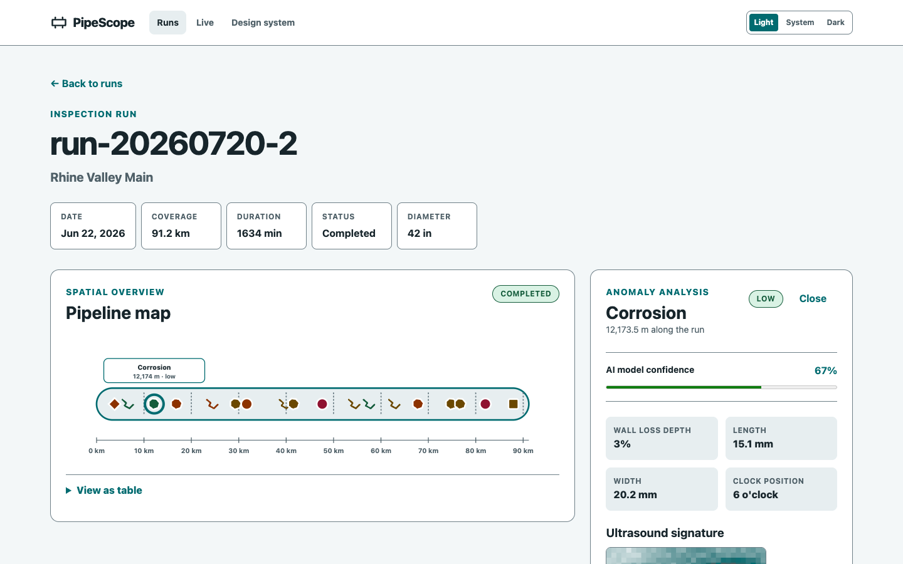
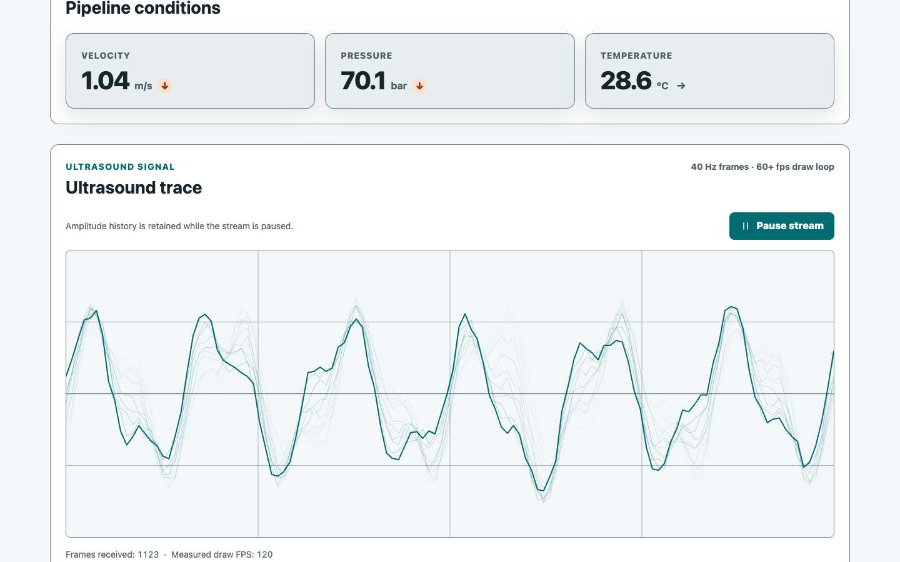
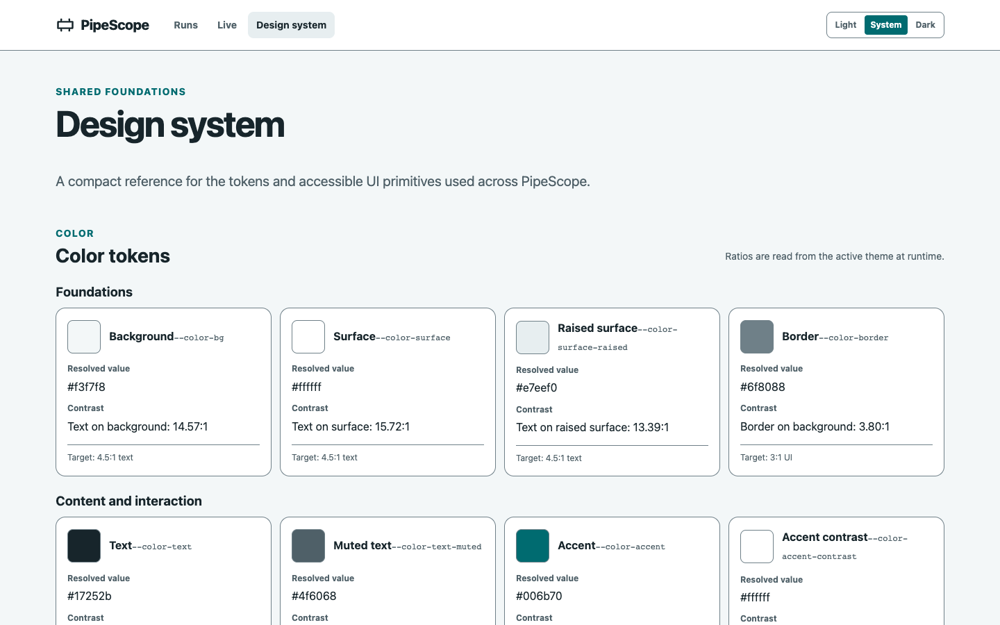
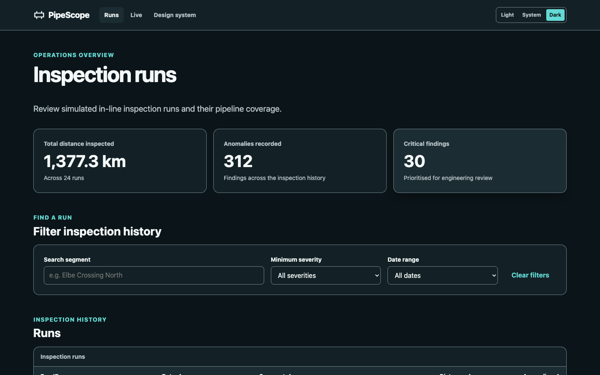

# PipeScope

## 30-second pitch

PipeScope is an Angular 22 showcase dashboard for exploring deterministic, simulated in-line pipeline inspection runs.
It combines a filterable run history, an accessible SVG pipeline map, and a live ultrasound stream rendered on canvas.
The project is intentionally small enough to read end to end while demonstrating production-minded change detection, data visualization, and accessibility decisions.

## Architecture

### Signals and zoneless change detection

PipeScope uses standalone Angular components with `OnPush` change detection and Angular v22's zoneless default.
Local UI state, derived values, route-bound selection, and the shared inspection store are represented with signals and `computed` values.
Angular records which signal consumers each template reads, so an update invalidates only the affected views instead of triggering a zone-wide event sweep.
RxJS is reserved for the 40 Hz telemetry source and is bridged to signals for stat readouts.
The canvas subscribes directly to the stream and keeps its imperative drawing loop outside Angular's reactive rendering path.

### Canvas and SVG

The live ultrasound view uses a canvas because it redraws a 128-sample trace with a persistence trail of recent frames at the display cadence, which should not create or mutate a large DOM tree at 40 Hz.
A ring buffer accepts frames while a `requestAnimationFrame` loop draws oscilloscope-style traces and exposes measured draw FPS.
The heatmap uses the same canvas approach for its fixed 32 by 24 amplitude grid.
The pipeline map uses SVG because its small set of anomaly markers, axis labels, focus states, and accessible roles benefit from semantic DOM elements.
Angular owns the SVG structure while `d3-scale` supplies the distance math.

### Deterministic data

The inspection generators use a seeded `mulberry32` PRNG and the constant `PIPESCOPE_SEED`.
The same seed produces the same runs, anomalies, heatmaps, and telemetry sequence, which keeps screenshots and tests reproducible without `Math.random()`.
Pure generators also make physics invariants and anomaly-count relationships straightforward to test.

### Project shape

The root shell owns navigation, focus management, and the theme service.
`core/` contains the domain model, deterministic generators, store, telemetry stream, and theme state.
`shared/ui/` contains the deliberately small badge, button, card, icon, theme switch, and data-table primitives.
The three lazy feature routes are `/runs`, `/runs/:runId`, and `/live`, with `/design-system` serving as the shared UI visual regression surface.

## Quickstart

Use the Node version in `.nvmrc`.

```bash
npm ci
npm start
```

The development server runs at `http://localhost:4200/`.

Run the unit suite once with:

```bash
npm test -- --run
```

Run linting with:

```bash
npm run lint
```

Build the production artifact with:

```bash
npm run build
```

Install Chromium once before local browser testing, then build and run the E2E harness:

```bash
npx playwright install chromium
npm run build
npm run e2e
```

The Playwright web server serves `dist/pipe-scope/browser` so local runs use the same static artifact shape as CI.
The `e2e/` directory currently contains only the valid harness configuration because the test specifications are owned by the E2E phase.

## Accessibility

The shell provides a skip link and moves focus to the page main landmark after navigation.
The pipeline map implements a roving tabindex with Left and Right arrows, Home, End, Enter, and Space, and exposes the same anomalies through a native table fallback.
Tables retain captions, sortable header buttons, `aria-sort`, and a keyboard-focusable overflow region.
Canvas visualizations have descriptive text alternatives, a throttled live reading summary, and a latest-readings table.
Severity is always expressed with text as well as color.
The live monitor starts paused when reduced motion is requested, while the global reduced-motion and forced-colors styles preserve usable focus and surface boundaries.
The token page reports runtime contrast ratios for the active theme, with text targets of 4.5:1 and UI-graphic targets of 3:1.

## Azure Static Web Apps

Create an Azure Static Web Apps resource and connect it to the repository or provide its deployment token to a GitHub Actions workflow.
Use the Angular build output as the deployment artifact:

```yaml
app_location: /
output_location: dist/pipe-scope/browser
app_build_command: npm run build
```

The root `staticwebapp.config.json` is copied into that browser output by the Angular asset configuration, so SPA fallback and security headers reach the deployed artifact.
The fallback rewrites application routes to `/index.html` while leaving JavaScript, CSS, and public assets to return normally.
For a CLI deployment, build first and deploy `dist/pipe-scope/browser` with an authenticated `swa deploy` command.

## Dependency note

`@ngrx/signals` is intentionally at 21.x because NgRx has not yet shipped Angular 22 peer support.
The checked-in `.npmrc` enables `legacy-peer-deps`, and `npm ci` respects that setting automatically.
Remove the workaround only when the compatible NgRx release is available and the lockfile has been refreshed.
